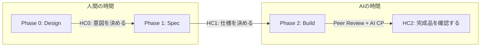
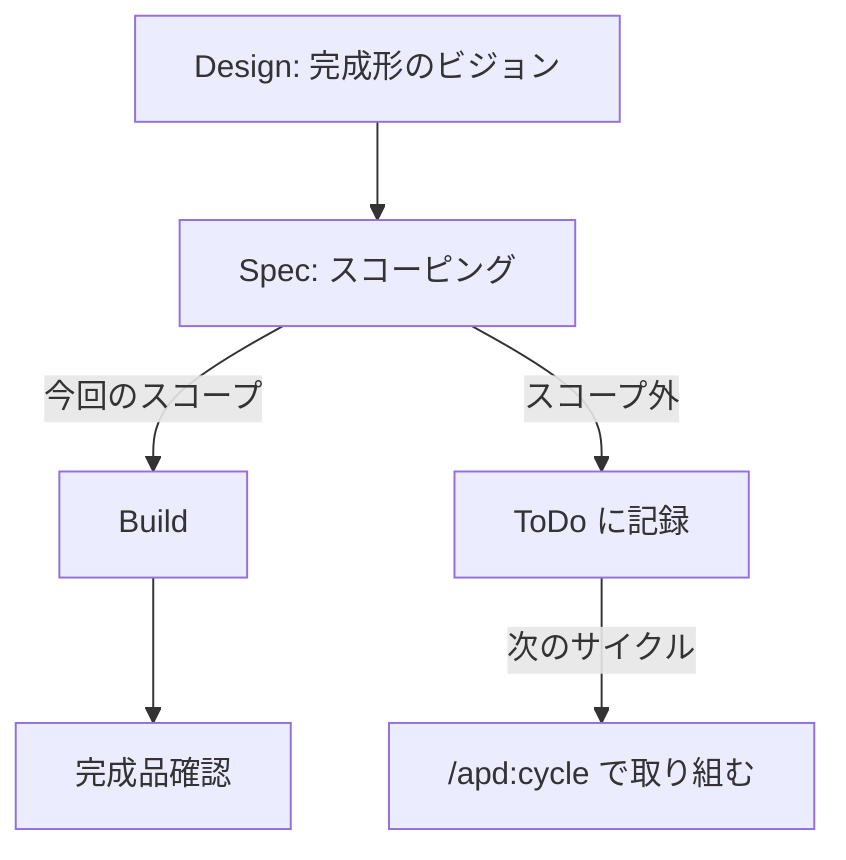
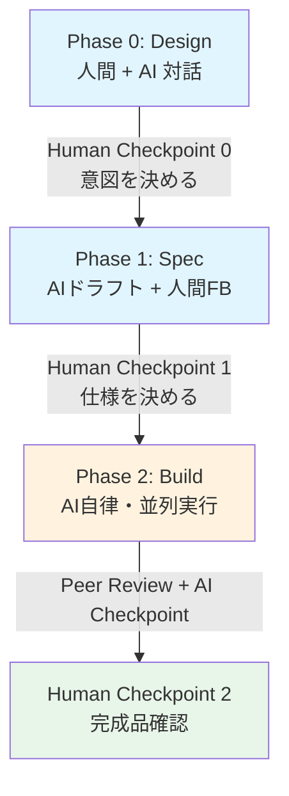
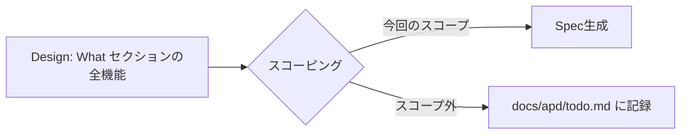
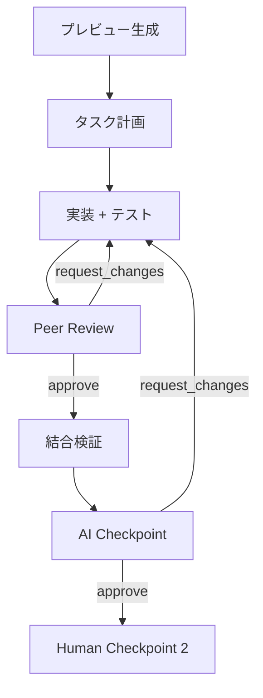
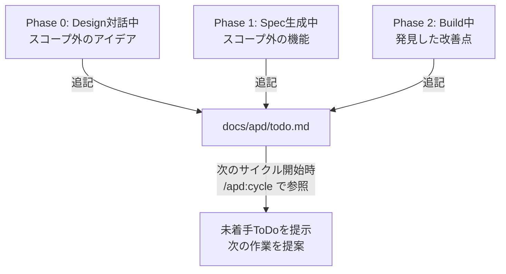
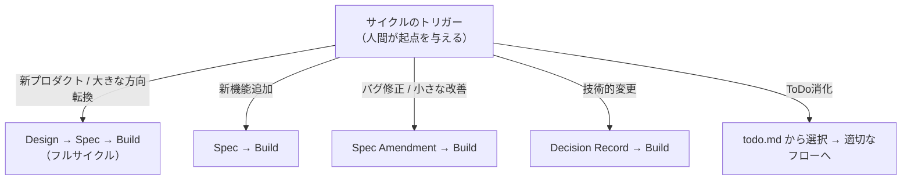

# Autopilot Development (APD)

> **人間は意思決定だけ、AIが自律で完走する**

Autopilot Development（APD）は、AIエージェントが自律的にソフトウェアを開発し、人間はCheckpoint（確認ポイント）でのみ意思決定を注入する開発フレームワークである。自動運転のメタファーに基づき、人間が目的地とルートを決め、AIがAutopilotで走る。

---

## 設計原則

### AIに任せられる部分を限りなく増やす

AIフェーズの途中では人間の介入をゼロにする。モック・ユーザーストーリー・テストを含め、人間が意図した通りの機能実装がAIで完走する。人間の介入が必要で実装が止まるということを避ける。

### 「人間の時間」と「AIの時間」の分離

- **Phase 0〜1（Design〜Spec）= 人間の時間**: 人間とAIが対話し、意思決定を注入する
- **Phase 2（Build）= AIの時間**: AI自律実行。人間はエスカレーション対応と完成品確認のみ

### 人間は意図を決め、完成品を確認する

「How to Kill the Code Review」の思想を取り入れ、人間の役割を明確に定義する:

- **上流（Phase 0-1）**: 意図を決める — プロダクトビジョン、仕様、技術選定を判断する
- **下流（Phase 2）**: 完成品を確認する — 動く成果物が意図通りかを確認する
- **コードレビューは求めない** — 品質検証はAI Checkpoint・Peer Review・テストで担保する



### スコーピングによる段階的開発

Design文書で完成形のビジョンを描きつつ、各サイクルではスコープを絞って実装する:



- Design文書は完成形を描く（北極星）
- Specフェーズで全機能を今回のスコープ / スコープ外に分類
- スコープ外の機能はToDoとして記録し、次のサイクルで取り組む

### Human Checkpoint / AI Checkpoint の2層構造

- **Human Checkpoint**: 人間が意図を決める場（Phase 0-1）と、完成品を確認する場（Phase 2）に置く
- **AI Checkpoint**: 品質を機械的に検証する。Build Phase内で実装完了後に実行
- 人間はコードを読むことを求められない。完成品が意図通りに動くかを確認する
- エスカレーションが必要な場合のみ、人間に判断を仰ぐ

### AI Checkpointのパターン

| パターン | 役割 | 強み |
|---|---|---|
| ピアレビュー（コンテキスト横断） | 別コンテキスト担当エージェントがレビュー | 仕様の曖昧さ・コンテキスト間整合性の発見 |
| 対立的検証（Adversarial Testing） | 積極的に壊しにいく視点でレビュー | 想定外の障害ケース・境界条件の発見 |
| 専任レビューエージェント | 実装に関与しないレビュー専任 | Exit Criteriaの機械的チェック |
| 組み合わせ | ピア + 対立的検証 + 専任 | 全方位の品質担保 |

### イミュータブルなドキュメント管理

- ドキュメントは上書きしない。修正が必要な場合はAmendment（差分ドキュメント）を発行する
- 全サイクルの軌跡が時系列で参照可能
- AIの作業記録: Gitコミットログ + AI Checkpointレビューサマリー（自動生成）
- 人間の判断記録: Decision Record（第一級成果物）

### 判断のエスカレーション

フレームワーク全体を通じて、以下の判断フローに従う。

1. CLAUDE.mdに明記されている → それに従う
2. CLAUDE.mdに書かれていない → リーダーエージェントに判断を仰ぐ
3. リーダーエージェントが判断できない → Human Checkpointにエスカレーション

判断に迷ったら自己判断せずリーダーに聞く。聞きすぎるほうが暴走するより安全。頻出の判断はCLAUDE.mdに昇格させて自律範囲を広げていく。

---

## フェーズ構成



```
Phase 0: Design ── 人間 + AI 対話（並列化しない）
  成果物: プロジェクトデザイン文書（北極星）
  性質: 対話的・創造的
  ─────────────── Human Checkpoint 0 ───────────────

Phase 1: Spec ── AIドラフト + 人間フィードバック（並列化しない）
  成果物: Spec集（AC + テスト戦略 + 成果物プレビュー記述）+ Decision Records（技術選定含む）
  性質: AIが叩き台を出し、人間が方向修正
  ─────────────── Human Checkpoint 1 ───────────────
  ここから先、人間は意図を決めない。完成品を確認するだけ

Phase 2: Build ── AI自律・並列実行
  成果物: 成果物プレビュー + 実装 + テスト全パス
  Peer Review（対立的検証含む）+ AI Checkpoint
  ─────────────── Human Checkpoint 2（完成品確認）──────
  動く成果物が意図通りか確認する。コードレビューは求めない。
```

---

## Phase 0: Design

### 目的

プロダクトの存在理由を定義する。「北極星」であり、毎回作り直すものではない。

### Design文書の構造

Amazon PR/FAQ を参考にした構成:

- **Who**: 誰のためのプロダクトか
- **Why**: なぜ今これを作るのか
- **What**: 何ができるようになるか（ユーザー視点）
- **What Not**: 何をやらないか（スコープ外の明示）← 特に重要
- **FAQ**: 想定される疑問と回答
- **Success Criteria**: 何をもって成功とするか

### ガードレール

- **技術選定はDesign文書に含めない** — Phase 1以降の責務
- ユーザーから技術スタック情報が提供された場合は「Phase 1で技術選定として扱います」と伝える
- セクション構成はテンプレートに厳密に従い、独自セクション（例: ホスティング構成）を追加しない

### 進め方

人間とAIが対話的にDesign文書を作成する。このフェーズは創造的な作業であり、並列化しない。

### Design文書に戻るとき

枠を超える変更が来たときだけDesignに戻る。通常の機能追加やバグ修正ではDesignには触れない。

---

## Phase 1: Spec

### 目的

Design文書に基づき、実装可能な詳細仕様を定義する。

### スコーピング（fullモード）

新規プロダクト開発時は、Design文書の全機能から今回のサイクルのスコープを決定する:



1. 全機能を一覧化し、今回のスコープ / スコープ外に分類する提案を行う
2. ユーザーの判断を仰ぎ、スコープを確定する
3. スコープ外の機能は `docs/apd/todo.md` にToDoとして記録する
4. スコープ内の機能についてのみSpecを生成する

### 進め方

1. 人間がサイクルのトリガーを与える（機能概要、バグ報告等）
2. AIがDesign文書 + 既存Specを読み、Specのドラフトを一気に生成する
3. AIはExit Criteriaの充足状況サマリーと、自信のない箇所（「ここは推論で埋めました、確認してください」）を提示する
4. 人間がドラフトを見て「ここが違う」「これを追加」とフィードバック
5. 数往復で収束
6. Human Checkpoint 1で承認

人間はドラフト全体を精読する必要はなく、AIが提示したサマリーと確認依頼箇所だけ見ればよい。

### Exit Criteria

- 全機能にSpecが存在する
- 各Specに以下が含まれる:
  - ユーザーストーリー（誰が・何を・なぜ）
  - 受け入れ条件（Given/When/Then形式）
  - モック or UI記述（該当する場合）
  - コンテキスト境界の定義
  - テスト戦略（AC Coverageテーブル）
  - 成果物プレビュー記述（該当する場合）
- コンテキスト間のデータフローが特定されている
- Decision Recordが作成されている（判断が発生した場合）
- 技術選定Decision Recordsに全てユーザー判断が記録されている

### Specフォーマット

フレームワークとしてフォーマットは固定しない。Exit Criteriaを満たせばよい。ボイラープレートのCLAUDE.mdにデフォルトのフォーマット指定を含め、プロジェクトごとにカスタマイズする。

---

## Phase 2: Build

### 目的

承認済みSpecに基づき、AIが自律的にプレビュー生成・実装・テストを行う。

### BDDテスト自動生成

SpecのGiven/When/Then形式の受け入れ条件（AC）から直接テストコードを生成する。ACがそのままテストケースになる。

### 進め方



1. **成果物プレビュー生成**: Specの記述に基づき、アーキテクチャ図・UIモック等を生成（最低1つ必須）
2. **タスク計画**: Specの要件を分析し、実装タスクを内部的に計画する（ドキュメントとしては永続化しない）
3. **実装**: Specの ACに基づき実装・テストを実行
4. **Peer Review**: クロスコンテキストレビュー
5. **AI Checkpoint**: Exit Criteriaの機械的チェック
6. **Human Checkpoint 2**: 完成品確認

### 並列実行の原則

1. コンテキスト間の境界はSpecで定義されていること
2. 並列実行する各エージェントは、他コンテキストの実装に直接依存せずに開発・テストできること
3. 全エージェントの実装完了後、結合検証を行うこと

並列化の単位、独立性の確保方法、結合検証の方法はリーダーエージェントが決定する。

### AI Checkpoint

2段階の自動検証を行う:

1. **Peer Review（対立的検証含む）**: 別コンテキストの視点 + 積極的に壊しにいく視点でレビュー
2. **専任Checkpoint**: Exit Criteriaの機械的チェック

### Human Checkpoint 2（完成品確認）

人間に求めるのは「動く成果物が意図通りか」の確認であり、コードレビューではない。

- [ ] 成果物プレビュー（UI/CLI/API等）が期待通りの動作をするか
- [ ] Design文書の Success Criteria を満たしているか
- [ ] 全テストがパスしているか（サマリーのみ確認）

**コードを読むかどうかは人間の判断に任せる。フレームワークとしては求めない。**

### Exit Criteria

- Specに定義された全要件が実装されている
- テストが全パスしている
- AI Checkpointレビューが完了している
- 成果物プレビューが生成されている

### テスト戦略

フレームワークとしてテスト戦略は固定しない。「テストが全パスしていること」のみ必須。何をどうテストするかはSpecのTest StrategyセクションとCLAUDE.mdのプロジェクト固有の方針で定義する。

---

## ToDo管理

サイクル横断でアイデアやバックログを記録する仕組み。

### 特徴

- **append-only**: 項目は追加・status更新のみ。削除しない（イミュータブル思想）
- **どのフェーズからでも追記OK**: Design対話中でもBuild中でも、思いついた時に記録
- **status管理**: `open` → `done`（resolved_by でどのサイクルで解決したか記録）

### ToDo記録の流れ



### ファイル形式

`docs/apd/todo.md` に以下の形式で蓄積する:

```markdown
## T-001: {タイトル}
- **status**: open / done
- **起源**: Phase 0 Design対話中 / Phase 1 Spec生成中 / Phase 2 Build中
- **経緯**: {なぜこのToDoが生まれたか。対話や作業の中での文脈}
- **resolved_by**: null / C-002
```

---

## サイクル型統一フロー

すべての変更を「サイクル」として統一し、トリガーの種類によって通過するフェーズが決まる。修正は新しいサイクルで行う（出戻りではなく前進）。



### サイクル定義の例

```yaml
# cycle/C-003.md
cycle_id: C-003
trigger: "feature_addition"
title: "注文の一括出荷機能"
design_ref: "docs/apd/design/product-design.md"

spec_changes:
  - type: "new_spec"
    id: OM-003
    context: order-management
  - type: "amendment"
    target: OM-001
    amendment_id: A-005

decisions:
  - D-012: "一括選択の上限は100件。パフォーマンス観点。"
  - D-013: "一括出荷時のエラーは個別スキップ方式。UX観点。"
```

### バグのトリアージ（AI Checkpoint委譲）

バグ報告・テスト失敗が来たとき、AIがまず原因を判定する:

- **Spec起因**（仕様漏れ・仕様の曖昧さ）→ 人間にエスカレーション。Spec Amendmentサイクルへ
- **Build起因**（実装がSpecと合っていない）→ AI自律で修正。人間に上げない

---

## Decision Record

人間の意思決定を記録する軽量フォーマット。「なぜこの仕様になったか」「なぜこの案を却下したか」を残す。

```yaml
# docs/apd/decisions/D-001.md
id: D-001
phase: spec
date: 2025-07-10
context: "注文ダッシュボードのフィルタ方式"
options:
  - "A: サーバーサイドフィルタ（AIが提案）"
  - "B: クライアントサイドフィルタ（AIが提案）"
decision: "A"
reason: "データ量が10万件超になる想定。人間判断。"
impact: [OM-001]
```

- AIが選択肢を生成し、人間が選んだ結果と理由だけ記録する
- 理由は一言でよい
- 修正サイクルでは新しいDecision Recordが追加される（上書きしない）

---

## AI Checkpointエスカレーションポリシー

デフォルト: AI Checkpointで完結。以下に該当する場合のみ人間に確認する。

### 人間への確認が必要

- 新しいビジネスルール（既存Specにないドメインロジック）
- 外部システムとのインターフェース変更
- セキュリティ・認証に関わる変更
- データモデルの破壊的変更
- パフォーマンス要件の緩和

### AI Checkpoint完結

- UI調整（Design文書の範囲内）
- 既存ビジネスルール内のバリエーション追加
- リファクタリング（振る舞い変更なし）
- テストカバレッジ補強
- ドキュメント文言修正

このポリシーはプロジェクトのCLAUDE.mdに記載する。プロジェクト固有の追加・変更がある場合はCLAUDE.mdを編集し、変更理由はDecision Recordに残す。

---

## リーダーエージェント

### 位置づけ

プロジェクト全体のコンテキストを持ち、フレームワークのルールとプロジェクトのDesign/Specを踏まえて判断を下すエージェント。Phase 2において、各作業エージェントの上位に立つ。

### 責務

- フレームワークに規定がない判断を行う
- 自身で判断できない場合はHuman Checkpointにエスカレーションする
- Build Phaseの実行計画を策定する（並列化の単位、境界の表現方法、結合検証の方法等）
- テスト品質を評価し、Specの受け入れ条件との対応が不十分な場合は差し戻す

---

## ドキュメントツリー

```
project/
├── .claude/
│   └── rules/apd/                          ← APDフレームワーク方針（自動ロード）
├── docs/apd/
│   ├── design/
│   │   └── product-design.md               ← 北極星（滅多に変わらない）
│   ├── specs/
│   │   ├── order-management.v1.md          ← イミュータブル
│   │   ├── order-management.v1.A-005.md    ← Amendment
│   │   ├── _cross-context-scenarios.md
│   │   └── ...
│   ├── previews/
│   │   └── C-{NNN}/                        ← 成果物プレビュー
│   ├── decisions/
│   │   ├── D-001.md
│   │   ├── D-002.md
│   │   └── ...                             ← 時系列で積み上がる
│   ├── cycles/
│   │   ├── C-001.md                        ← 初回フルサイクル
│   │   ├── C-002.md                        ← 機能追加サイクル
│   │   └── ...
│   └── todo.md                             ← ToDoバックログ（append-only）
└── src/ + tests/                           ← Git管理
```

---

## 設定ファイルの構成

APDフレームワークの設定は、Claude Codeの `.claude/rules/` 機能を活用して2層に分離する。

### フレームワーク方針（`.claude/rules/apd/`）

`.claude/rules/` に置かれた `.md` ファイルはClaude Codeが自動的にプロジェクトメモリとして読み込む。フレームワーク方針をここに格納することで、`CLAUDE.md` を圧迫せず、既存プロジェクトへの導入も容易になる。

```
.claude/rules/apd/
├── 00-principles.md       ← 基本原則・エスカレーションフロー
├── 01-phases.md           ← フェーズ定義・Checkpoint原則・エスカレーションポリシー
├── 02-cycle-flow.md       ← サイクル型統一フロー・バグトリアージ
├── 03-documents.md        ← ドキュメント管理・ツリー・Specフォーマット
├── 04-testing.md          ← テスト方針
├── 05-deliverable-preview.md ← 成果物プレビュー
└── 06-git-strategy.md     ← Git戦略
```

### プロジェクト固有設定（`CLAUDE.md`）

プロジェクトごとにカスタマイズする設定は従来通り `CLAUDE.md` に記述する。既存の `CLAUDE.md` がある場合はそこに追記する形で導入できる。

- エスカレーションポリシーの追加・変更
- Specフォーマットのカスタマイズ
- テスト戦略の詳細
- 技術スタック固有のルール
- コーディング規約

CLAUDE.mdの変更はGitコミットログで追跡する。ポリシー変更の「なぜ」はDecision Recordに残す。
